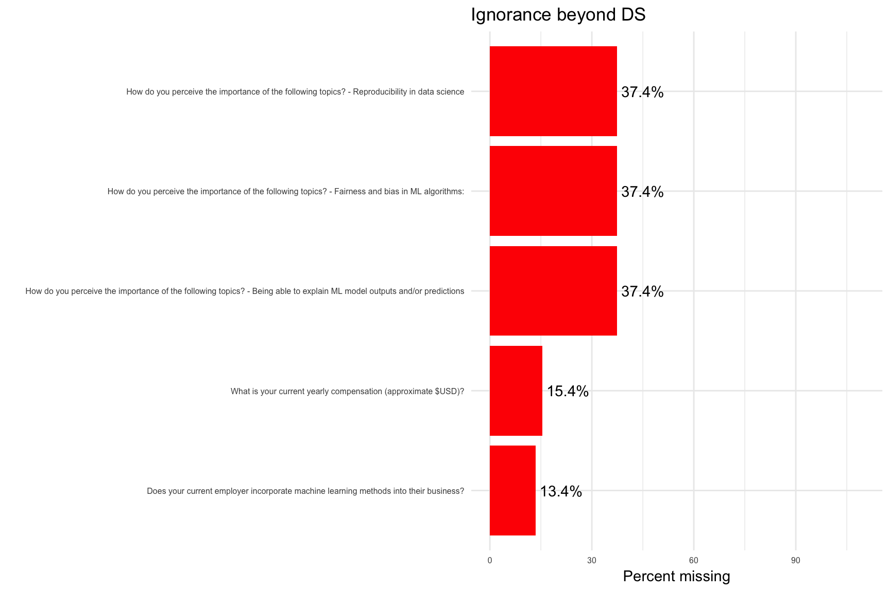
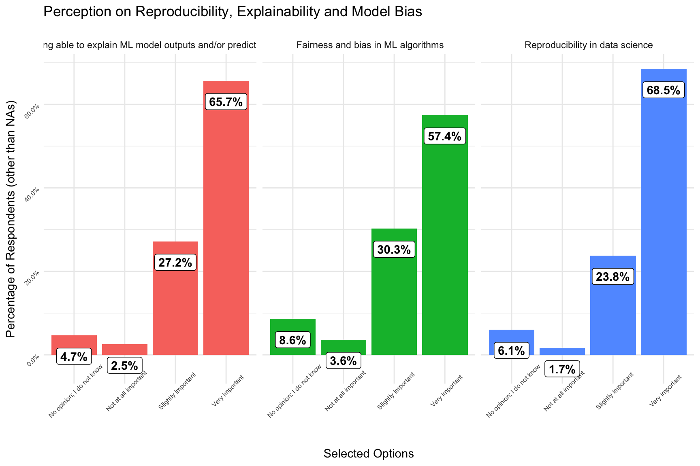
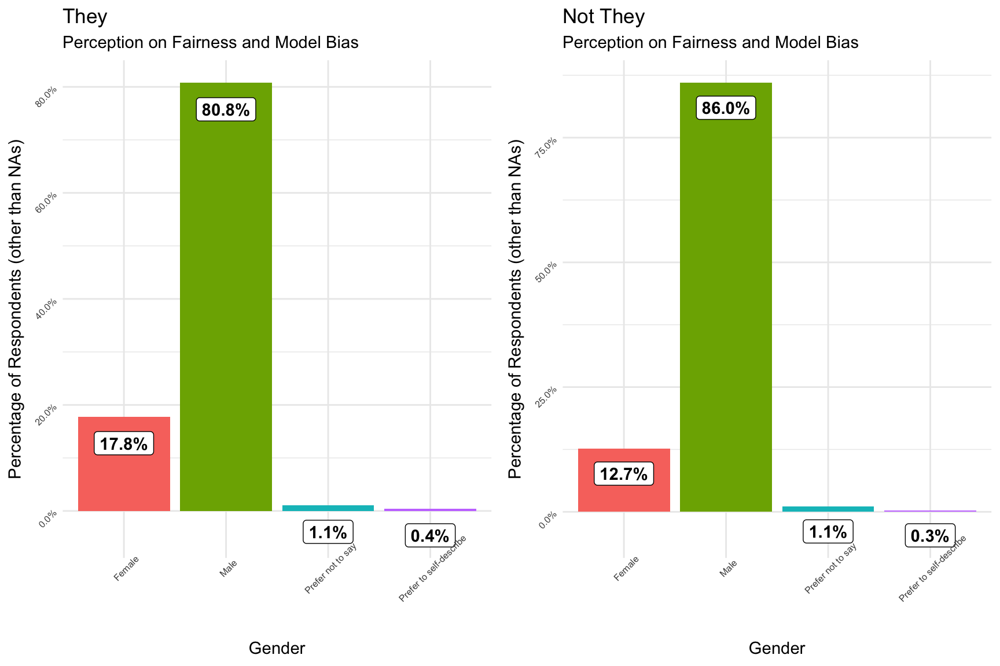
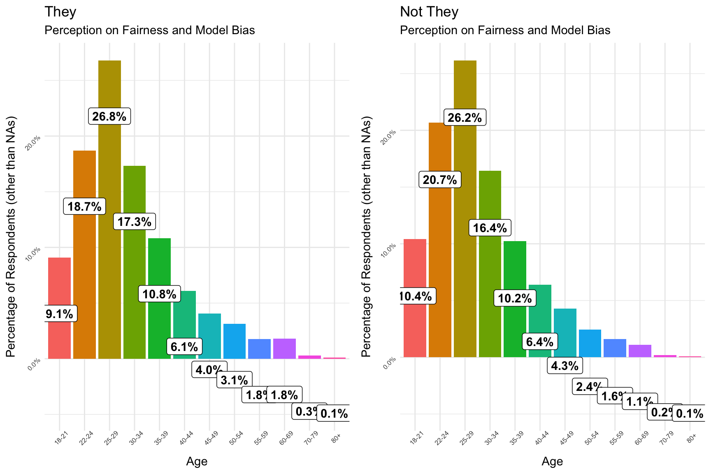

### Do Computers Lie?

We have been constantly told this statement "Computers don't lie". Yes in fact Computers don't lie, but neither does it speak the truth. A computer does what its Master programs it to do. Similarly, A model wouldn't lie unless the Machine Learning Engineer doesn't want it to lie. 


### Machine Bias

There was a nice episode of the podcast [You are not so smart](https://youarenotsosmart.com/2017/11/20/yanss-115-how-we-transferred-our-biases-into-our-machines-and-what-we-can-do-about-it/) came out last year. This is an excerpt from it:

*“I want a machine-learning algorithm to learn what tumors looked like in the past, and I want it to become biased toward selecting those kind of tumors in the future,” explains philosopher Shannon Vallor at Santa Clara University.  “But I don’t want a machine-learning algorithm to learn what successful engineers and doctors looked like in the past and then become biased toward selecting those kinds of people when sorting and ranking resumes.”*


### The Problem

Machine Bias can occur due to a lot of factors but a few to name is:

* Biased Training Dataset
* Bias Variable in the Feature Space
* BlackBox Modelling of not understanding what's going on with the Model 

Below is an example of how Google Translate, when translated the following text to a Gender-neutral langauge and back to English - applies its bias (primarily due to the nature of biased Training Dataset)


### The Solution

The first step of finding solution to any problem is accepting **The Problem exists**. Let's accept that fact and see how to use Kaggle Survey results and help the community tackle Machine Bias.

### Libraries


```r
suppressPackageStartupMessages(library(tidyverse)) 
suppressPackageStartupMessages(library(highcharter))
suppressPackageStartupMessages(library(DataExplorer))
suppressPackageStartupMessages(library(scales))
suppressPackageStartupMessages(library(cowplot))

plotting_missing <- function(df){

  #based on erikbruin's code snippet
    
NAcol <- which(colSums(is.na(df)) > 0)
NAcount <- sort(colSums(sapply(df[NAcol], is.na)), decreasing = TRUE)
NADF <- data.frame(variable=names(NAcount), missing=NAcount)
NADF$PctMissing <- round(((NADF$missing/nrow(df))*100),1)
NADF %>%
    ggplot(aes(x=reorder(variable, PctMissing), y=PctMissing)) +
    geom_bar(stat='identity', fill='red') + coord_flip(y=c(0,110)) +
    labs(x="", y="Percent missing") +
    geom_text(aes(label=paste0(NADF$PctMissing, "%"), hjust=-0.1))
}
```


```r
survey <- read_csv("input/multipleChoiceResponses.csv", skip = 1, col_types = cols())
```

### Ignorance is Bliss - but not always! 
  


```r
p1  + theme_minimal() + theme(axis.text = element_text(size = 6)) + labs(title = "Ignorance beyond DS") 
```




The above plot is to demonstrate how much these questions that are about Model Fairness / Bias, have been ignored. 

While asking about **Salary made 15% of respondents** to not answer, Questions about **Reproducibility, Explainability and Bias made 37% of respondents** to skip answering. The salary question comparsion is here to show relatively worse questions like this are approached. 


### Reproducibility, Explainability and Bias


```r
survey %>% select(contains("How do you perceive the importance of the following topics?")) %>% 
  gather() %>% 
  mutate(key = str_replace(key,"-","\n")) %>% 
  mutate(key = str_replace(key,"How do you perceive the importance of the following topics?",""),
         key = str_replace(key, regex("\\?"),""), 
         key = str_replace(key, regex("\\-|\\:"),"")) %>% 
  group_by(key) %>% 
  count(value) %>% 
  drop_na() %>% 
  mutate(n = n / sum(n)) %>% 
  ggplot() + geom_col(aes(value,n, fill = key, ), stat = "identity", show.legend = FALSE) +
   geom_label(aes(x = value, y = n - 0.05, label = percent(n)),
           # hjust=0, vjust=0, size = 4, colour = 'black',
            fontface = 'bold') +
  facet_wrap(~key) +
  scale_y_continuous(labels = percent_format()) +
  theme_minimal() + 
  theme(axis.text = element_text(angle = 45, size = 6)) +
  labs(title = "Perception on Reproducibility, Explainability and Model Bias ",
       x = "Selected Options",
       y = "Percentage of Respondents (other than NAs)")
```




**Fairness and Bias:**

* Only close to half (57.4%) of the respondenrts who chose to answer consider Fairness and Bias in ML Algorithm is a **Very important**.

* This is the lowest **Very important** sentiment echoed by the community of all the 3 questions.

* **3.6%** of those who chose to respondent perceive this is **Not at all important**, which is the highest **Not at all important** feeling expressed of all 3 questions.


 

```r
survey %>% select(contains("How do you perceive the importance of the following topics?")) %>% 
  gather() %>% 
  mutate(key = str_replace(key,"How do you perceive the importance of the following topics?",""),
         key = str_replace(key, regex("\\?"),""), 
         key = str_replace(key, regex("\\-"),"")) %>% 
  group_by(key) %>% 
  count(value) %>% 
  mutate(n = percent(n / sum(n)))  %>% 
  spread(value,n) %>% 
  knitr::kable()
```


key                                                         No opinion; I do not know   Not at all important   Slightly important   Very important   <NA>  
----------------------------------------------------------  --------------------------  ---------------------  -------------------  ---------------  ------
Being able to explain ML model outputs and/or predictions   2.9%                        1.6%                   17.0%                41.1%            37.4% 
Fairness and bias in ML algorithms:                         5.4%                        2.3%                   19.0%                36.0%            37.4% 
Reproducibility in data science                             3.8%                        1.0%                   14.9%                42.9%            37.4% 

## Who are they?

*They* refer to those beings who think Fairness and Bias are **Very Important** in Machine Learning. 


```r
they <- survey %>% filter(`How do you perceive the importance of the following topics? - Fairness and bias in ML algorithms:` == "Very important")


not_they <- survey %>% filter(`How do you perceive the importance of the following topics? - Fairness and bias in ML algorithms:` != "Very important")
```


### Gender 


```r
they %>% group_by(`What is your gender? - Selected Choice`) %>% count() %>% ungroup() %>% 
  rename("Gender" = `What is your gender? - Selected Choice`) %>% 
  mutate(n = n / sum(n),
         perc = percent(n)) %>% 
   ggplot() + geom_col(aes(Gender,n, fill = Gender), stat = "identity", show.legend = FALSE) +
   geom_label(aes(x = Gender, y = n - 0.05, label = percent(n)),
           # hjust=0, vjust=0, size = 4, colour = 'black',
            fontface = 'bold') +
  scale_y_continuous(labels = percent_format()) +
  theme_minimal() + 
  theme(axis.text = element_text(angle = 45, size = 6)) +
  labs(title = "They",
       subtitle = "Perception on Fairness and Model Bias ",
       x = "Gender",
       y = "Percentage of Respondents (other than NAs)") -> p1
```

```
## Warning: Ignoring unknown parameters: stat
```

```r
not_they %>% group_by(`What is your gender? - Selected Choice`) %>% count() %>% ungroup() %>% 
  rename("Gender" = `What is your gender? - Selected Choice`) %>% 
  mutate(n = n / sum(n),
         perc = percent(n)) %>% 
    ggplot() + geom_col(aes(Gender,n, fill = Gender), stat = "identity", show.legend = FALSE) +
   geom_label(aes(x = Gender, y = n - 0.05, label = percent(n)),
           # hjust=0, vjust=0, size = 4, colour = 'black',
            fontface = 'bold') +
  scale_y_continuous(labels = percent_format()) +
  theme_minimal() + 
  theme(axis.text = element_text(angle = 45, size = 6)) +
  labs(title = "Not They",
       subtitle = "Perception on Fairness and Model Bias ",
       x = "Gender",
       y = "Percentage of Respondents (other than NAs)") -> p2
```

```
## Warning: Ignoring unknown parameters: stat
```

```r
cowplot::plot_grid(p1,p2)
```




* There is a difference of **5.1 PP** Female Percentage difference between those who perceive **Model Fariness & Bias in ML** is **Very Important** and Others.

* While this could be seen as that **Female Gender** usually gets affected by these Biases, It's also important to realize that **Male Gender** (Kaggler's) don't echo similar sentiment as their female counterpart. After all, A healthy model is what we all want, don't we?


### Age 


```r
they %>% group_by(`What is your age (# years)?`) %>% count() %>% ungroup() %>% 
  rename("Age" = `What is your age (# years)?`) %>% 
  mutate(n = n / sum(n),
         perc = percent(n)) %>% 
   ggplot() + geom_col(aes(Age,n, fill = Age), stat = "identity", show.legend = FALSE) +
   geom_label(aes(x = Age, y = n - 0.05, label = percent(n)),
           # hjust=0, vjust=0, size = 4, colour = 'black',
            fontface = 'bold') +
  scale_y_continuous(labels = percent_format()) +
  theme_minimal() + 
  theme(axis.text = element_text(angle = 45, size = 6)) +
  labs(title = "They",
       subtitle = "Perception on Fairness and Model Bias ",
       x = "Age",
       y = "Percentage of Respondents (other than NAs)") -> p1
```

```
## Warning: Ignoring unknown parameters: stat
```

```r
not_they %>% group_by(`What is your age (# years)?`) %>% count() %>% ungroup() %>% 
  rename("Age" = `What is your age (# years)?`) %>% 
  mutate(n = n / sum(n),
         perc = percent(n)) %>% 
    ggplot() + geom_col(aes(Age,n, fill = Age), stat = "identity", show.legend = FALSE) +
   geom_label(aes(x = Age, y = n - 0.05, label = percent(n)),
           # hjust=0, vjust=0, size = 4, colour = 'black',
            fontface = 'bold') +
  scale_y_continuous(labels = percent_format()) +
  theme_minimal() + 
  theme(axis.text = element_text(angle = 45, size = 6)) +
  labs(title = "Not They",
       subtitle = "Perception on Fairness and Model Bias ",
       x = "Age",
       y = "Percentage of Respondents (other than NAs)") -> p2
```

```
## Warning: Ignoring unknown parameters: stat
```

```r
cowplot::plot_grid(p1,p2)
```



### WIP 

Please share your appreciation through upvote, More importantly comments to improve this Kernel!
